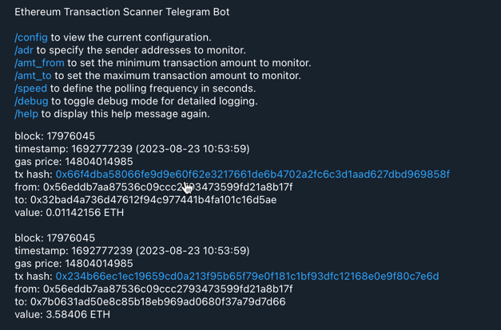

# New Ether Transfers Notifier Telegram Bot

## Description
Etherscan has a great new (to the moment) feature of advanced filtering, although it lacks the ability to notify about the new transacitons.
This simple Etherscan-powered Telegram bot fills in this gap and notifies about new incoming Ether transfers from
a gven wallet that lies within a given range.

## Usage

1. Create a new Telegram bot using [@BotFather](https://t.me/BotFather) and get the bot token.
2. Create a new Telegram channel and add the bot as an administrator (or tweak its rights and invite it into a group
   chat ).
3. Create an Etherscan API key [here](https://etherscan.io/myapikey).
4. Clone this repository and install dependencies
   Poetry is used as a build system, so you need to install it first, on top of Python 3 and pip.
   Plain pip, conda or any other package manager work fine as well.

```bash
poetry install
```

5. Copy `.env.example` to `.env` and fill in the values.
   run the `main.py`, the most obvious way is to use pm2 or systemd as a process manager since that's a server.

Note the Etherscan poll rate limitations! there are 5 per second and 1 mln per day on the free tier.

## Telegram bot
```shell
/config to view the current configuration.
/adr to specify the sender addresses to monitor.
/amt_from to set the minimum transaction amount to monitor.
/amt_to to set the maximum transaction amount to monitor.
/speed to define the polling frequency in seconds.
/debug to toggle debug mode for detailed logging.
/help to display this help message again.
```
